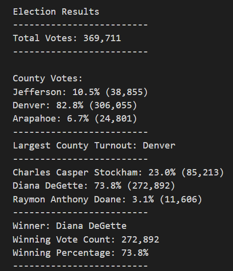

# Election Audit Findings

## Overview of Election Audit
- The purpose of this project was to assist Seth and Tom with an election audit, to provide a breakdown of the number of votes and percentage of the total votes each candidate received, and to illustrate which candidate won the election, their vote count, and their percentage of total votes.  These results were shared with the election commission, and the commission has requested some additional data to complete the audit:
  - The voter turnout for each county
  - The percentage of votes from each county out of the total count
  - The county with the highest turnout

## Election Audit Analysis and Results
- The following are the election audit findings that were provided to the election commission.
 

- Total Votes Cast: 
  - 369,711
- Individual County Names, Voting Percentage, and Number of Votes:
  - Jefferson: 10.5% (38,855)
  - Denver: 82.8% (306,055)
  - Arapahoe: 6.7% (24,801)
- County with Largest Number of Votes:
  - Denver
- Individual Candidate Names, Voting Percentage, and Number of Votes:
   - Charles Casper Stockham: 23.0% (85,213)
   - Diana DeGette: 73.8% (272,892)
   - Raymon Anthony Doane: 3.1% (11,606) 
   - Associated code: `votes = candidate_votes.get(candidate_name) vote_percentage = float(votes) / float(total_votes) * 100 candidate_results = (f"{candidate_name}: {vote_percentage:.1f}% ({votes:,})\n")`
- Election Results:
  - Winner: Diana DeGette
  - Winning Vote Count: 272,892
  - Winning Percentage: 73.8% 
## Election-Audit Summary: In a summary statement, provide a business proposal to the election commission on how this script can be used—with some modifications—for any election. Give at least two examples of how this script can be modified to be used for other elections.
