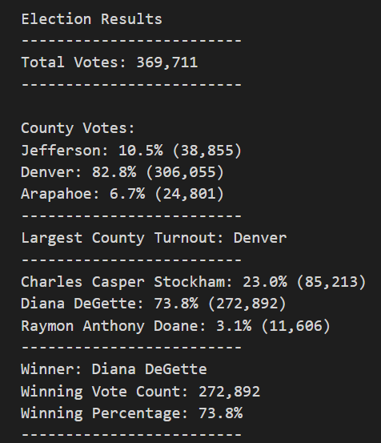
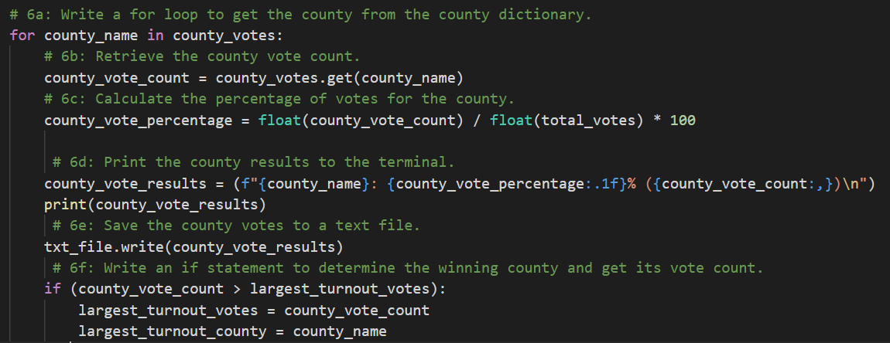

# Election Audit Findings

## Overview of Election Audit
- The purpose of this project was to assist Seth and Tom with an election audit, to provide a breakdown of the number of votes and percentage of the total votes each candidate received, and to illustrate which candidate won the election, their vote count, and their percentage of total votes.  These results were shared with the election commission, and the commission has requested some additional data to complete the audit:
  - The voter turnout for each county
  - The percentage of votes from each county out of the total count
  - The county with the highest turnout

## Election Audit Analysis and Results
- The following are the election audit findings that were provided to the election commission.  

  

- Total Votes Cast: 
  - 369,711
- Individual County Names, Voting Percentage, and Number of Votes:
  - Jefferson: 10.5% (38,855)
  - Denver: 82.8% (306,055)
  - Arapahoe: 6.7% (24,801)
  - The following image illustrates the for loop that was created to come up with the county results.
   
   
  
           
- County with Largest Number of Votes:
  - Denver
  - The following statement was created to show Denver county residents cast the largest number of votes.
    
    `if (county_vote_count > largest_turnout_votes):
            largest_turnout_votes = county_vote_count
            largest_turnout_county = county_name`
- Individual Candidate Names, Voting Percentage, and Number of Votes:
   - Charles Casper Stockham: 23.0% (85,213)
   - Diana DeGette: 73.8% (272,892)
   - Raymon Anthony Doane: 3.1% (11,606) 
- Election Results:
  - Winner: Diana DeGette
  - Winning Vote Count: 272,892
  - Winning Percentage: 73.8% 
## Election Audit Summary
- As the project a summary statement, provide a business proposal to the election commission on how this script can be used—with some modifications—for any election. 
- As the project manager of this project, I created code that could be geared to work for all types of elections: local, state, and national.  With a few modifications, the election commission could use this code for future elections without having to re-invent the wheel and without having to pay for a full audit again.  For a fee that would equate to two hours (at $x/hour),  I would be willing to provide support to the election commission for future elections and provide the following modifications per election.
- Give at least two examples of how this script can be modified to be used for other elections.
- For example, if the election commission is going to monitor or audit national elections next year.  Some examples of the services and modifactions that would be made would be to clean future election data, upload and read the csv files.  I also would create new variables and scripts very similar to the candiates and counties, but create it for the national election.
